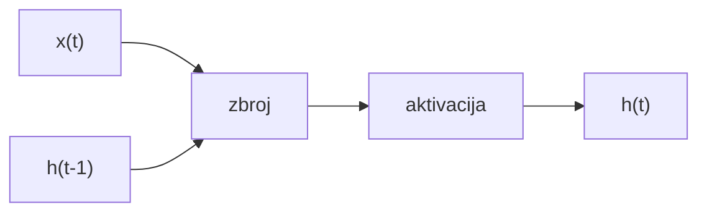
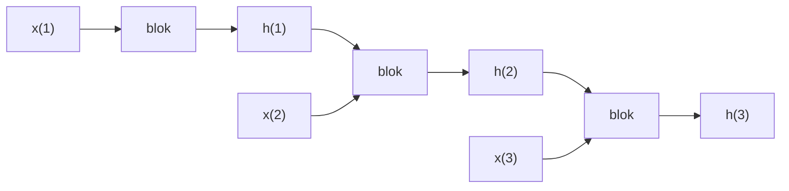
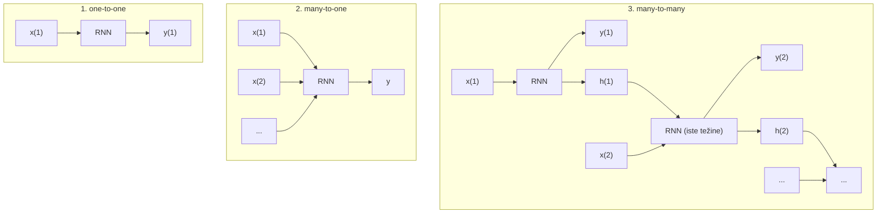
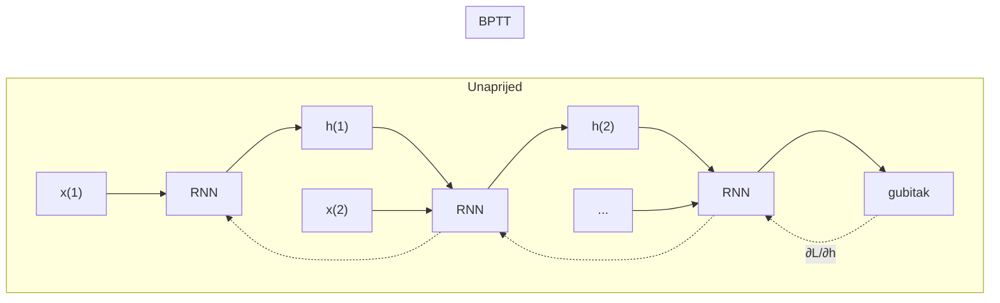
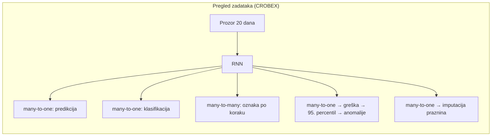
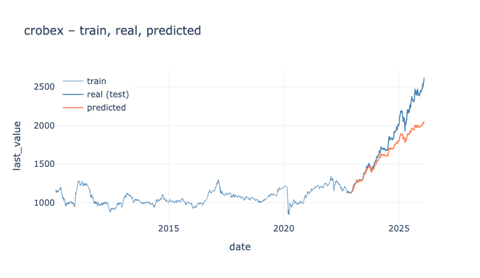
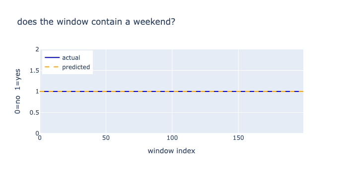
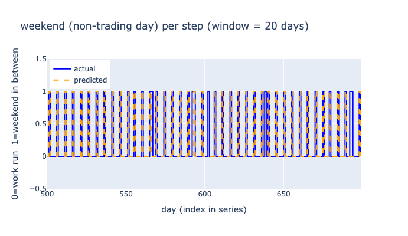
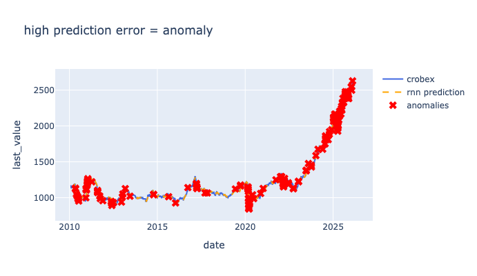
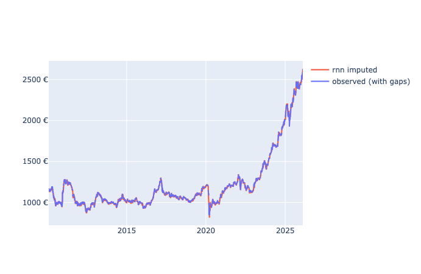

# Rekurentne neuronske mreže (RNN): rad s sekvencijalnim podacima

| Kolegij                      | Student      | Datum       | Voditelj        |
| ---------------------------- | ------------ | ----------- | --------------- |
| Uvod u umjetnu inteligenciju | Dražen Barić | 11.02.2026. | Saša Mladenović |

## Uvod

### Sekvencijalni podaci

Sekvencijalni podaci su nizovi poredani u vremenu ili drugom redoslijedu: vremenske serije (indeksi, senzori), tekst, zvuk. U takvim podacima redoslijed je bitan, a duljina je često varijabilna. Zato model koji radi s nizovima mora imati pristup kontekstu prošlosti (Pešut, 2019, Rajić, 2024).

### Zašto obične mreže nisu dovoljne

Feedforward mreža ima fiksni ulaz i izlaz te nema ugrađeno pamćenje prošlosti, pa za rad s sekvencijama nije prirodan izbor. Potrebna je arhitektura koja koristi prošlost, tu ulogu imaju rekurentne neuronske mreže (RNN), koje prošlost kodiraju u hidden state-u koji se ažurira u svakom koraku (Pešut, 2019).

### Cilj rada

U radu se iznosi kratki uvod u teoriju: što je RNN i kako se uči. Zatim se kroz praktične primjere na ZSE CROBEX podacima u Jupyter notebookima primjenjuje navedeno: predikcija sljedeće vrijednosti, klasifikacija sekvence, označavanje po koraku, detekcija anomalija i imputacija.

## Rekurentne neuronske mreže: osnove

### Ideja i memorija

Hidden state h(t) ovisi o ulazu x(t) i prethodnom stanju h(t-1). To upravo čini „pamćenje“ prošlosti. Ista jedinica (iste težine) ponavlja se u vremenu, tako da se parametri dijele kroz sve korake (Pešut, 2019, Rajić, 2024).

### Jedan neuron kao gradivni blok

U svakom koraku t jedinica prima x(t) i prethodno stanje. Ulazi se ponderiraju težinama, zbrajaju s biasom (pomakom) i prolaze kroz aktivaciju, a rezultat je novo stanje h(t). Shematski prikaz dan je u nastavku.

_Slika 1: Jedan RNN korak: ulazi x(t) i h(t-1) ulaze u zbroj (s težinama i biasom/pomakom), zatim aktivacija daje h(t)._

### Unrolling u vremenu

Isti blok ponavlja se za t = 1, 2, ..., T, pri čemu se stanje prenosi iz jednog koraka u sljedeći.

_Slika 2: Unrolling: isti blok, stanje h se prenosi naprijed._

Korištenje izlaza može biti na više načina: samo reprezentacija cijele sekvence (npr. zadnje stanje ili agregacija svih stanja) ili izlaz na svakom koraku (niz). Odabir ovisi o zadatku (Pešut, 2019). To se formalno izražava tipovima mapiranja ulaz-izlaz.

### Tipovi mappinga (one-to-one, many-to-one, many-to-many)

U tipu many-to-one cijela sekvenca preslikava se u jednu oznaku (npr. predikcija jedne vrijednosti ili klasifikacija): često se koristi zadnje stanje, ali moguće su i agregacije (npr. pooling/attention) preko svih vremenskih koraka. U tipu many-to-many izlaz se daje u svakom koraku (oznaka po elementu), a u općenitijoj varijanti (seq2seq) ulazna i izlazna duljina ne moraju biti jednake.

_Slika 3: Tipovi mappinga: one-to-one, many-to-one (cijela sekvenca → jedna oznaka), many-to-many (izlaz u svakom koraku)._

## Treniranje i izazovi

> **Gradijent** je mjera kako promjena težina mijenja gubitak, a u RNN-u se pri učenju (BPTT) on računa unazad kroz **unrolled** mrežu, tj. lanac istog bloka razmotanog po vremenskim koracima.  
> Na dugim sekvencama gradijent može **nestajati** (vanishing) ili **eksplodirati** (exploding), što otežava stabilno učenje i hvatanje dugoročnih ovisnosti.

Učenje RNN-a temelji se na BPTT (backpropagation through time), koji propagira gradijent unazad kroz unrolled mrežu.

Na dugim nizovima čest je problem nestabilnosti gradijenta: vanishing (slabljenje) i exploding (eksplozija). Kod osnovnog RNN-a javlja se problem nestajućeg gradijenta - gradijenti nestaju dok se propagiraju prema početnim vremenskim koracima (Čagalj, 2025).

GRU (engl. gated recurrent unit) i LSTM (engl. long short-term memory) ublažavaju taj problem: navedene mreže sadrže vrata (engl. gates) koja prate vremenske obrasce, a konačni izlaz ovisi o aktivacijama tih vrata (Čagalj, 2025). U praksi se exploding gradijent često kontrolira npr. gradient clippingom. U ovom radu se u primjerima koristi SimpleRNN radi preglednosti (Pešut, 2019, Rajić, 2024).

_Slika 4: BPTT – gradijent se propagira unazad kroz unrolled mrežu (strelice isprekidane). Na dugim nizovima može doći do vanishing/exploding gradijenta. LSTM i GRU taj problem ublažavaju._

## Tipovi zadataka i primjene

U nastavku su primjeri iz [notebooks/](notebooks/): predikcija, klasifikacija, anomalije, imputacija i označavanje po koraku.

Klasifikacija sekvence i označavanje implementirani su u PyTorchu, a ostali primjeri u Kerasu (TensorFlow). U svima je koncept sličan: prozor ulaznih značajki (npr. vrijednost, a po potrebi i dodatne značajke), RNN i izlaz koji može biti jedan ili po koraku.

U svim primjerima ulazne vrijednosti skaliraju se **MinMaxScalerom** radi stabilnijeg učenja RNN-a. Hiperparametri (broj epoha, veličina batcha, 16 ili 32 skrivene jedinice) razlikuju se po zadatku i odabrani su radi preglednosti.

_Slika 5: Isti blok (prozor + RNN), različita uporaba izlaza i postprocesinga u pet primjera. Z1, Z2, Z4 i Z5 koriste zadnje stanje (many-to-one), a Z3 koristi izlaz na svakom koraku (many-to-many)._

### Predikcija sljedeće vrijednosti

Kao ulaz služi prozor od 20 uzastopnih skaliranih vrijednosti CROBEXa. RNN uči predvidjeti sljedeću vrijednost (gubitak MSE). Podatak se dijeli 80 % za učenje i 20 % za test (vremenski redoslijed se čuva).

U notebooku su izračunati MSE, MAE i RMSE na treningu i na testu: na testu su MSE i RMSE znatno veći nego na treningu, što ukazuje na lošiju generalizaciju na neviđene periode.

U notebooku je prikazano kako se grade X i y te graf stvarnih i predviđenih vrijednosti.

**Notebook:** [predict-next-value.ipynb](notebooks/predict-next-value.ipynb)

_Slika 6: Stvarno vs predviđeno (predict-next-value)._

### Klasifikacija sekvence

Korišten je prozor od 20 **trgovačkih** dana. Ulaz uključuje dvije značajke po koraku: skaliranu vrijednost CROBEXa i **dan u tjednu** (normaliziran na [0, 1], ponedjeljak–nedjelja). Iz zadnjeg stanja RNN daje jednu oznaku: sadrži li prozor barem jedan **netrgovački razmak** (razlika od ≥2 kalendarska dana između uzastopnih zapisa: tipično vikend, ali može biti i praznik).

> Napomena: na korištenom CROBEX skupu podataka i s prozorom od 20 dana ova oznaka ispada **uvijek 1**, pa je primjer prikazan prvenstveno kao demonstracija many-to-one postavke (ne kao smislen, balansiran klasifikacijski problem).

**Notebook:** [sequence-classification.ipynb](notebooks/sequence-classification.ipynb)

_Slika 7: Klasifikacija (sequence-classification)._

### Oznaka po koraku

Ulaz je isti kao kod klasifikacije: prozor od 20 koraka s dvije značajke (skalirana vrijednost i **dan u tjednu**). Izlaz RNN-a koristi se u svakom od 20 koraka: linearni sloj predviđa postoji li nakon tog dana **netrgovački razmak** (gap ≥ 2 kalendarska dana do sljedećeg zapisa, vikend/praznik).

Zbog neravnomjerne raspodjele primijenjene su **težine klasa** izračunate kao inverz kvadratnog korijena frekvencije klase, normalizirane. Kvadratni korijen ublažava pojačanje u odnosu na čisti inverz frekvencije (1∕n), pa se rijetka klasa pojačava umjereno i učenje ostaje stabilnije.

Prikazane su stvarne i predviđene oznake po koraku.

**Notebook:** [sequence-labeling.ipynb](notebooks/sequence-labeling.ipynb)

_Slika 8: Oznaka po koraku (sequence-labeling)._

### Detekcija anomalija

RNN ponovno uči predvidjeti sljedeću vrijednost iz prozora od 20 dana. Greška je **apsolutna** (|stvarno − predviđeno|). Anomalijom se smatra mjesto na kojem je ta greška iznad 95. percentila (prag se može ispisati i u originalnoj skali). Oznake anomalija vrijede tek od (seq_len + 1)-og vremenskog koraka, jer prvih 20 vrijednosti nema predikciju.

Prikazana je serija s označenim anomalijama.

**Notebook:** [anomaly-detection.ipynb](notebooks/anomaly-detection.ipynb)

_Slika 9: Anomalije (anomaly-detection)._

### Imputacija

RNN je treniran na trgovačkim danima da iz 20 prethodnih predvidi sljedeći dan. Imputacija se radi na **cijelom kalendarskom rasponu** (svaki dan od min do max datuma u podacima): netrgovački dani su praznine (NaN).

Za svaki nedostajući niz (gap) uzimaju se zadnjih 20 **opaženih** vrijednosti prije njega: ako ih nema dovoljno, prozor se nadopunjuje prvom dostupnom opaženom vrijednošću. Jedna RNN predikcija popunjava cijeli gap (bez autoregresije po kalendaru). Ako povijest i dalje nije dovoljna, koristi se **forward-fill** ili **backward-fill**.

Prikazane su praznine i imputirana serija.

**Notebook:** [imputation.ipynb](notebooks/imputation.ipynb)

_Slika 10: Imputacija (imputation)._

## Pregled: notebook → sekcija

| Notebook                                                                 | Sekcija          |
| ------------------------------------------------------------------------ | ---------------- |
| [predict-next-value.ipynb](notebooks/predict-next-value.ipynb)           | Predikcija       |
| [sequence-classification.ipynb](notebooks/sequence-classification.ipynb) | Klasifikacija    |
| [sequence-labeling.ipynb](notebooks/sequence-labeling.ipynb)             | Oznaka po koraku |
| [anomaly-detection.ipynb](notebooks/anomaly-detection.ipynb)             | Anomalije        |
| [imputation.ipynb](notebooks/imputation.ipynb)                           | Imputacija       |

## Zaključak

U radu smo izložili osnove RNN-a i na CROBEX vremenskoj seriji proveli pet primjera (predikcija, klasifikacija, označavanje po koraku, detekcija anomalija, imputacija).

Isti gradivni blok (prozor ulaza, rekurentna jedinica sa skrivenim stanjem i odabir izlaza: zadnje stanje ili niz) dovoljan je za vrlo različite zadatke. Pri tome se ne mijenja arhitektura, već način korištenja izlaza i postprocesing: prag pogreške za anomalije, jedna predikcija po praznini za imputaciju, težine klasa za neravnomjernu raspodjelu pri označavanju.

Time se potvrđuje da memorija kroz h(t) zaista preuzima ključnu ulogu kod sekvencijalnih podataka i da je RNN prirodan okvir kada redoslijed ima smisla.

## Literatura

- Pešut, L. (2019). _Rekurentne neuronske mreže_ (diplomski rad). Sveučilište u Zagrebu, Prirodoslovno-matematički fakultet, Matematički odsjek, Zagreb. Trajna poveznica: https://urn.nsk.hr/urn:nbn:hr:217:487817 (pristupljeno 10. 2. 2026.). (`literature/unizg-pmf-diplomski-pesut.pdf`)

- Rajić, I. (2024). _Rekurentne neuronske mreže_ (diplomski rad). Sveučilište u Zagrebu, Prirodoslovno-matematički fakultet, Fizički odsjek, Zagreb. Trajna poveznica: https://urn.nsk.hr/urn:nbn:hr:217:923477 (pristupljeno 10. 2. 2026.). (`literature/unizg-pmf-diplomski-rajic.pdf`)

- Čagalj, I. T. (2025). _Optimizacija hiperparametara i augmentacija podataka u dubokom učenju za lokalizaciju i detekciju zvukova_ (diplomski rad). Sveučilište u Splitu, Prirodoslovno-matematički fakultet, Odjel za informatiku, Split. (`literature/unist-pmf-diplomski-cagalj.pdf`)
